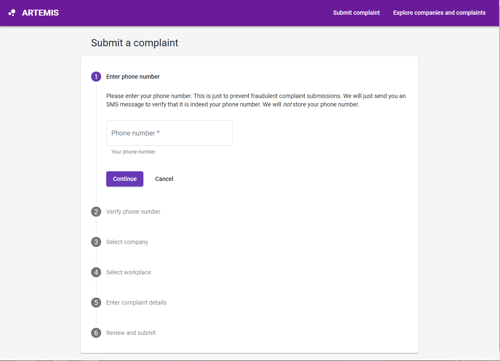

Artemis Complaints is a anonymous complaint web platform built with mainly Angular JS and Go. It is being created with three other peers and started at January 2019. The project helped me understand how GitFlow works in a team, merging feature branches, pull requests, any many other Git related skills. 

The website has provides the user with unique url keys to optimize the follow-up process. This way we don't have to explicitly store user's data which served the purpose of the website being anonymous. Angular Material was used to design the angular components.

In this project I gained valuable experience with full-stack web development and associated technologies, including GitFlow, [Angular](http://angular.io) for front-end, the [Twitter Bootstrap](http://getbootstrap.com/) CSS Framework for the user interface, and Javascript for both client and server-side programming with [Golang](https://golang.org/).
 
Source: <a href="https://artemis-complaints.herokuapp.com/">Artemis/artemis</a>
