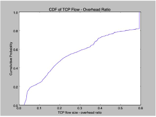

In this report, we perform critical analysis on Per-Pack Statistics(Packet Size and Packet Header Size), 
Per-Flow Statistics(Flow Type, Flow Duration), TCP Overhead Ratio(Hit Ratio), Inter-Packet Arrival Time, and lastly 
Round Trip Time estimation.

The estimated RTT is stable because according to algorithm from RFC6298, our "a" is small enough to be negligible 

RTT is influenced by various factors that we derived from this report. 

1) Distance 

        The distance a signal has to travel directly correlates to the time taken for request    
        
2) Transmission Medium

        Type of medium use to route a connection can impact the RTT
        
3) Number of network hops

        Intermediate routers and servers takes time to process the connection which causes RTT to increase. 
        More hops implies higher RTT.
        
4) Traffic Levels (Congestion)

    RTT increases when a network is congested with high level of traffic, vice versa.
       

 
Source: <a href="https://github.com/haminthecoder/RTT-Estimation"><i class="large github icon"></i>RTT Estimation</a>
